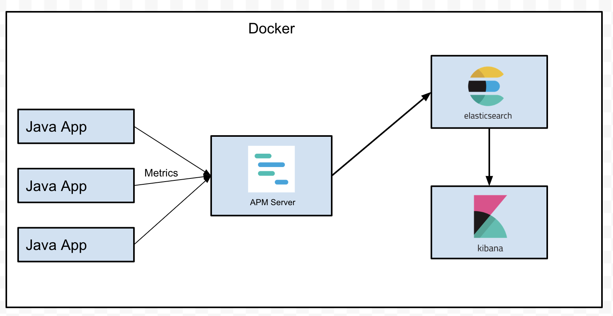
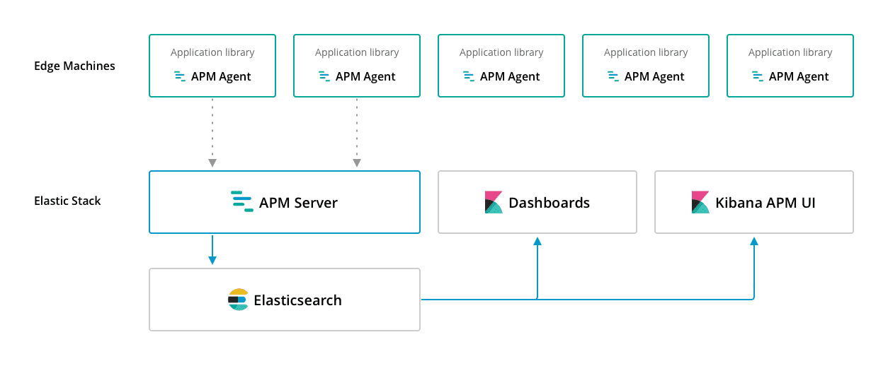
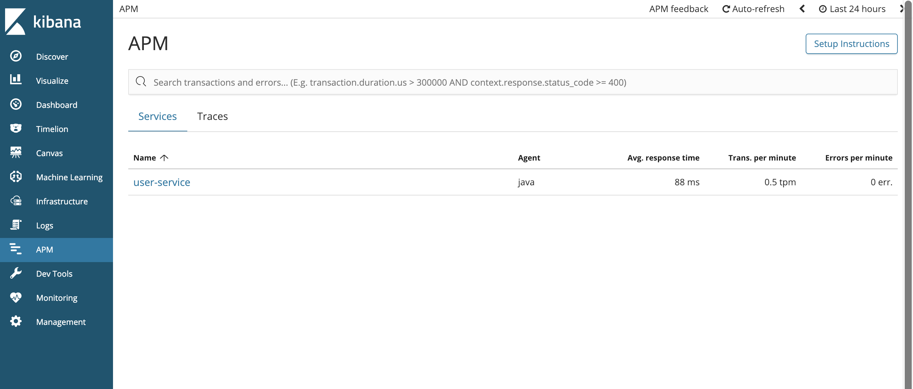
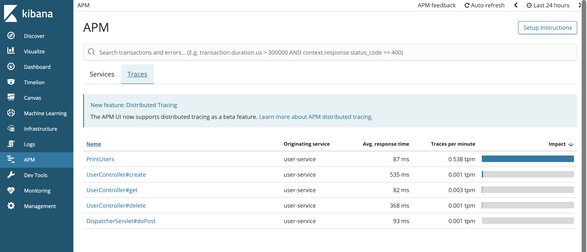
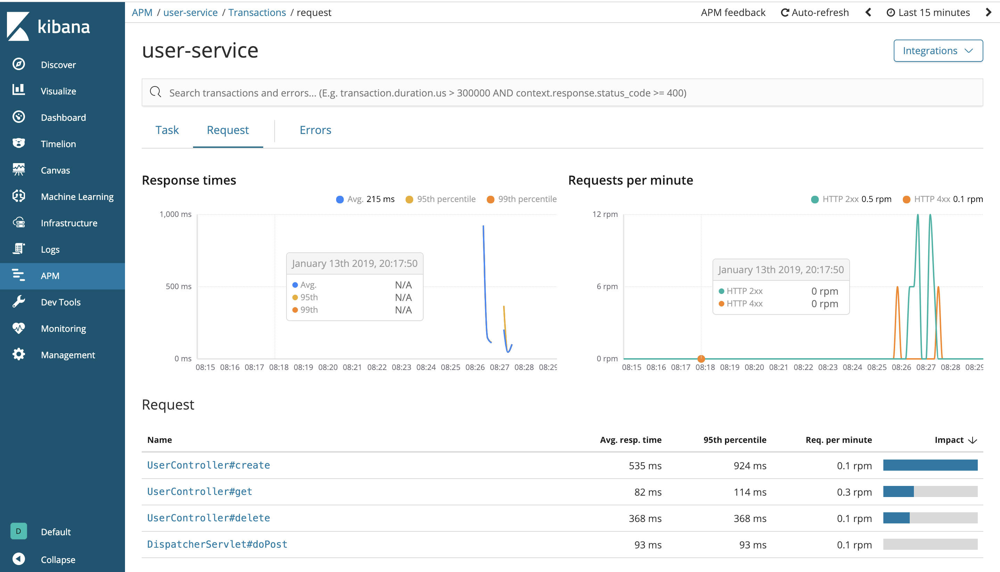
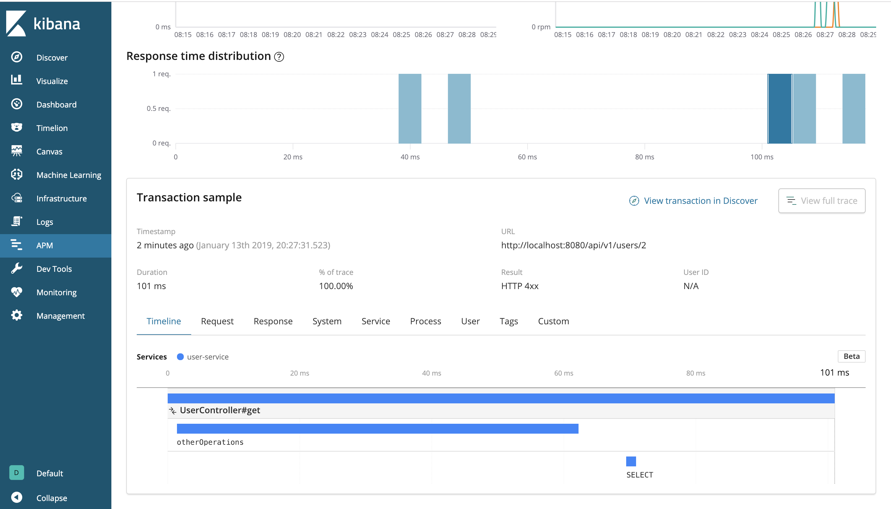
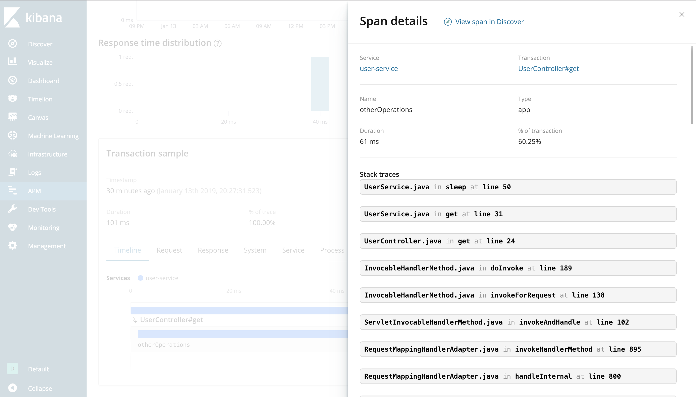
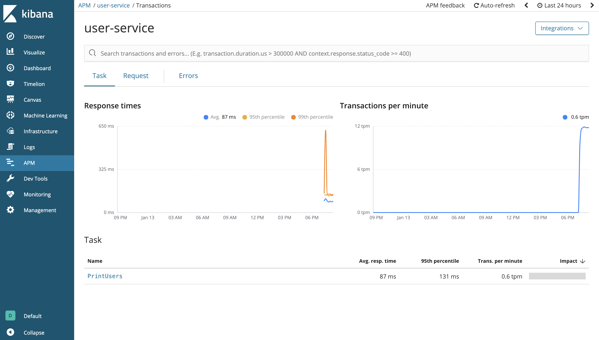
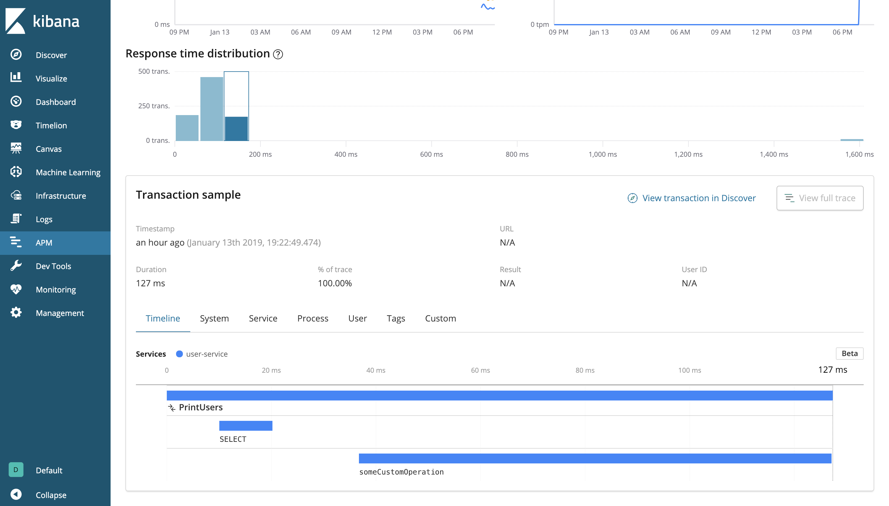

# Monitor Spring Boot Application Performance with Elastic APM, Elasticsearch and Kibana

## Introduction
In this article we will learn how to monitor performance for a simple Spring Boot application. But first we need to define what is application performance monitoring and why do we need it. 

Application performance monitoring also known as APM is used to check that application meet performance standards and provide a good quality user experience.

Most APM tools collect metrics about the response time for incoming requests, CPU utilisation, bandwidth used, memory consumption, data throughput, database commands, code executions and so on. We need APM to have an idea how application behaves over time and how it responds under different throughput's. Also very often APM dashboards are used to quickly discover, isolate and solve problems when they appear.

In this tutorial we are going to:
1. Develop a REST API and some background tasks using Spring Boot 2
2. Deploy application as docker container
3. Deploy Elastic APM, Elasticsearch and Kibana as docker containers
4. Use Kibana APM dashboard to monitor Spring Boot application

To complete of this tutorial, I assume you have installed Maven, Docker and docker-compose. If you don't have it already, follow the official instructions. This article assumes that the Docker runs natively and the containers are accessible through localhost.
 
## Architecture

All services used in this tutorial will run as docker containers. Our purpose is to monitor performance for Java applications, so we will have some containers with Spring Boot application. These applications will be profiled by a java agent provided by Elastic. 

The java agent will collect and send metrics to the APM server and then the APM server will transform this metrics and in the will send them to the Elasticsearch. Once metrics are stored in Elasticsearch, you can explore your application performance by using Kibana built-in APM dashboards which can be found under the "APM" tab.



## Elastic APM

Elastic APM it allows you to monitor applications in real time, collecting detailed performance metrics on response time for incoming requests, database queries, external HTTP requests, etc. Elastic APM has two components: 
* APM Server
* APM agents



APM server is an open source application written in GO. his purpose it's to receive data from APM agents, transforms them into Elasticsearch documents. It does this by exposing a JSON HTTP api.

APM Agents instrument your code and collect performance data and errors at runtime. The data is buffered for a short period of time after which it is sent to the APM Server. Agents are written in the same programming language as your application. Elastic provide agents for the following languages:
1. Java
2. Node Js
3. Ruby
4. Python
5. Go

The purpose of this article is to monitor Java application, so we will discuss more details about the Java agent. First, it can be used as any other java agent by using `-javagent:path/to/agent.jar` when you start your jar. Also you need specify some mandatory parameters such as: apm server url, your service name and java packages to scan, for more details check the [official documentation](https://www.elastic.co/guide/en/apm/agent/java/current/configuration.html).

The Elastic APM Java agent automatically instruments various APIs, frameworks and application servers, you can check supported technologies [here](https://www.elastic.co/guide/en/apm/agent/java/current/supported-technologies-details.html). For our demo application, the agent will automatically collect performance data for Spring Web MVC and Spring Data JPA(MySQL).

If you have technologies that aren't supported by the agent or you want to collect some custom metrics it can be done using [agent API](https://www.elastic.co/guide/en/apm/agent/java/current/public-api.html). With this api you can programmatically generate performance metrics.    

## Spring Boot Application
The Java application which will be monitored is a Spring Boot 2 application. Using Spring Boot we're going to create a simple REST api for users that are stored in a MYSQL server, the api will provide simple CRUD operations for users data.

Besides the REST api, application will have some scheduled backgrounds tasks. This tasks does no do anything util, they are built only to show how we can monitor background tasks by using APM Agent public API.

###### REST endpoints

* GET `/api/v1/users/{userId}` - Returns user with id from db or 404 if no user was found
* POST `/api/v1/users` - Creates a new user. Request body sample: `{"name":"Cosmin Seceleanu","email":"test@email.com"}` 
* DELETE `/api/v1/users/{userId}` - Deletes a user


## Deploy services

 1. `git clone https://github.com/cosminseceleanu/tutorials.git`
 2. `cd tutorials/elastic-apm-java`
 3. `mvn package` - build Spring Boot jar file
 4. Build and start containers using `docker-compose -f docker/docker-compose.yml up -d`
 5. Checking containers status using `docker-compose -f docker/docker-compose.yml ps` and you should have 5 containers: Elasticsearch, MySQL, Kibana, APM server and the java service
 
 
 
 If APM Server service doesn't start, is because it uses Elasticsearch and Elasticsearch take some time to start. To solve this, just restart some containers using this command: `docker-compose -f docker/docker-compose.yml restart apm user-microservice
`. 

#### Spring Boot Service Dockerfile

```dockerfile
FROM openjdk:8-jdk

EXPOSE 8080
RUN mkdir -p /opt/app
WORKDIR /opt/app

ARG JAR_PATH
COPY $JAR_PATH /opt/app
RUN wget -O apm-agent.jar https://search.maven.org/remotecontent?filepath=co/elastic/apm/elastic-apm-agent/1.2.0/elastic-apm-agent-1.2.0.jar

CMD java -javaagent:/opt/app/apm-agent.jar $JVM_OPTIONS -jar $JAR_NAME
```

### APM Server Dockerfile

```dockerfile
FROM docker.elastic.co/apm/apm-server:6.5.4
COPY apm-server.yml /usr/share/apm-server/apm-server.yml
USER root
RUN chown root:apm-server /usr/share/apm-server/apm-server.yml
USER apm-server
```

### APM Server Configuration

In the APM Server configuration we need to configure input and output of the server. For input we specify the host and port where the HTTP Api will run, and for the output we set Elasticsearch hosts.

Also we will configure APM Server to automatically setup APM indices, dashboards and other things in Kibana, for this we just set Kibana uri and enable the flag `setup.dashboards.enabled`. 

```yml
apm-server:
  host: "0.0.0.0:8200"
  concurrent_requests: 5
  rum:
    enabled: true

queue.mem.events: 4096
max_procs: 4

output.elasticsearch:
  hosts: ["http://elasticsearch:9200"]

setup.kibana.host: "kibana:5601"
setup.dashboards.enabled: true

logging.level: info
logging.to_files: false
```


## Monitor Application

What will we monitor?
1. Time for incoming http requests
2. Throughput
2. Time for MySQL queries
3. Using APM agent public api we will monitor time for some custom code and a background task 

To have some metrics we need to call our service, we can do using the `curl` command. If you want to execute a large number of request you can use this tools:  
* [Apache Bench](https://httpd.apache.org/docs/2.4/programs/ab.html)
* [Apache JMeter](https://jmeter.apache.org/)

For the next metrics that I will show you I am going to execute the following curl commands:
* curl -X POST http://localhost:8080/api/v1/users -H "Content-Type: application/json" -d '{"name":"Cosmin Seceleanu","email":"cosmin.seceleanu@email.com"}'
* curl -X POST http://localhost:8080/api/v1/users -H "Content-Type: application/json" -d '{"name":"Foo Bar","email":"foo@bar.com"}'
* curl -X GET http://localhost:8080/api/v1/users/1
* curl -X GET http://localhost:8080/api/v1/users/2
* curl -X DELETE http://localhost:8080/api/v1/users/2
* curl -X GET http://localhost:8080/api/v1/users/1
* curl -X GET http://localhost:8080/api/v1/users/1
* curl -X GET http://localhost:8080/api/v1/users/2

After you execute some HTTP requests you can use Kibana by accessing http://localhost:5601 and under the APM tab, you should see a list of services(agents) with some summary performance metrics.
> List of APM Agents/Services where every list item contains summary data, such as: average response time, transactions per minute, errors per minute

 

> Overview of transactions for all services

 

> Dashboard with metrics about incoming HTTP requests, here we can find transactions for all http endpoints of our REST Api, and for each transaction we can see average response time, request per minute and other important metrics.

 

> If you want see more details about a transaction you can click on any transaction, for example if you click on UserController#get transaction you will see details similar with the image below.  

 

In the above picture we can see that for a GET request, most of the time is spent with `otherOperations`, this represents a custom method call inside `UserService`. 
For this custom metric I've used agent API to measure how much time is spent with this method call, because by default APM agent will not measure it, and it's done by adding annotation `CaptureSpan` to the method.

```java
package com.cosmin.tutorials.apm.service;

import co.elastic.apm.api.CaptureSpan;
import com.cosmin.tutorials.apm.database.User;
import com.cosmin.tutorials.apm.database.UserRepository;
import org.slf4j.Logger;
import org.slf4j.LoggerFactory;
import org.springframework.beans.factory.annotation.Autowired;
import org.springframework.stereotype.Service;

import java.util.Optional;
import java.util.Random;

@Service
public class UserService {
    private final static Logger logger = LoggerFactory.getLogger(UserService.class);
    private UserRepository userRepository;

    @Autowired
    public UserService(UserRepository userRepository) {
        this.userRepository = userRepository;
    }


    public User save(User user) {
        sleep();
        return userRepository.save(user);
    }

    public Optional<User> get(Integer id) {
        sleep();
        return userRepository.findById(id);
    }

    public void delete(Integer id) {
        sleep();
        userRepository.deleteById(id);
    }

    @CaptureSpan("otherOperations")
    private void sleep() {
        try {
            Random random = new Random();
            int milis = random.nextInt(100 - 20 + 1) + 20;
            logger.info(String.format("Sleep ---> %s ms", milis));
            Thread.sleep(milis);
        } catch (Exception e) {
           logger.error(e.getMessage(), e);
        }
    }
}

```    

> Details of the otberOperations from UserController#get transaction



> Details of the UserController#get transaction 

 

> Details of the sql query executed during UserController#get transaction 


All of the above pictures was about incoming http requests, but we also monitor background tasks. Metrics for this can be found under the `Task` tab in the top of the dashboard.

> Dashboard with metrics about transactions with type Task, and for each transaction we can see average response time, request per minute.



The performance metrics about tasks are generated using agent public Api, but this time we need to generate the transaction by using annotation `@CaptureTransaction` as you can see in the bellow Java code:

```java
package com.cosmin.tutorials.apm.tasks;

import co.elastic.apm.api.CaptureSpan;
import co.elastic.apm.api.CaptureTransaction;
import com.cosmin.tutorials.apm.database.UserRepository;
import org.slf4j.Logger;
import org.slf4j.LoggerFactory;
import org.springframework.beans.factory.annotation.Autowired;
import org.springframework.scheduling.annotation.Scheduled;
import org.springframework.stereotype.Service;

import java.util.Random;

@Service
public class PrintUsersTask {

    private final static Logger logger = LoggerFactory.getLogger(PrintUsersTask.class);
    private UserRepository userRepository;

    @Autowired
    public PrintUsersTask(UserRepository userRepository) {
        this.userRepository = userRepository;
    }

    @Scheduled(fixedDelayString = "5000")
    public void execute() {
        logger.info("run scheduled test");
        doExecute();
    }

    @CaptureTransaction(type = "Task", value = "PrintUsers")
    private void doExecute() {
        userRepository.findAll().forEach(user-> logger.debug(user.getEmail()));
        sleep();
    }

    @CaptureSpan("someCustomOperation")
    private void sleep() {
        try {
            Random random = new Random();
            int milis = random.nextInt(120 - 20 + 1) + 20;
            Thread.sleep(milis);
        } catch (Exception e) {
            logger.error(e.getMessage(), e);
        }
    }
}

```

> Details about PrintUser task transaction




## Resources:
1. https://docs.docker.com/
2. https://docs.docker.com/compose/
3. https://www.elastic.co/guide/en/apm/server/current/running-on-docker.html
4. https://www.elastic.co/guide/en/apm/agent/java/current/index.html
5. https://www.elastic.co/guide/en/apm/server/current/index.html
6. https://github.com/cosminseceleanu/tutorials
7. https://www.elastic.co/guide/en/elasticsearch/reference/current/docker.html
8. https://www.elastic.co/guide/en/kibana/current/index.html